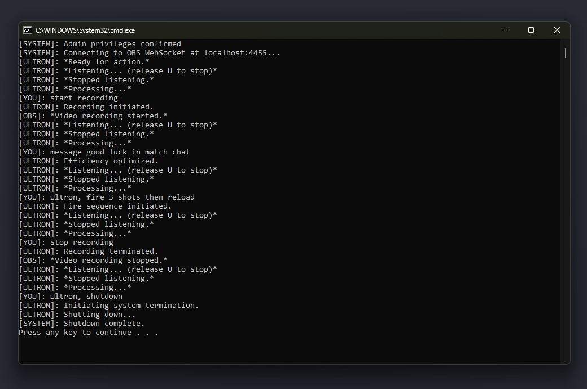

# Ultron-AI


Voice-controlled AI gaming assistant for Marvel Rivals.

Made as a submission to [The Bay](https://shipwrecked.hackclub.com/info/the-bay), an online, project-based, summer coding event by Hack Club.

Note this is still WIP and Ultron does not process commands correctly 100% of the time



## Features

-   Voice Recognition - Processes natural language from microphone
-   TTS - Fast text-to-speech responses with pitch shifting and echo for a robotic voice
-   Ultron Personality - Responses emulate Ultron's cold, calculating and efficient persona
-   In-game Commands - Detects and performs specific in-game commands from speech
-   In-game Vision - Visually detects UI changes to alert when your Ultimate ability is ready in-game
-   OBS Integration - Control OBS recording and replay buffer / clip saving via WebSockets
-   Easy Configuration - Uses a single `.env` file for Groq API key and OBS credentials. Also `config.py` for program configuration

## Building from Source

### Prerequisites

#### Hardware

-   A working microphone
-   A stable internet connection (required for Google Speech Recognition and Groq API)

#### Software

-   Marvel Rivals Game (Windows): The game must be installed and running.

-   Python 3.12+:

    -   Download and install from [python.org/downloads](https://www.python.org/downloads/)
    -   During installation, ensure you check "Add Python to PATH."
    -   You can check your Python version by running `python --version` or `python3 --version` in your terminal.

-   Windows Voice: Ultron uses Microsoft's David voice

    -   Ensure it is installed on your system.
    -   Can be found at: `Settings > Time & Language > Speech > Manage voices`

-   Groq API Key:

    -   Sign up at [console.groq.com/keys](https://console.groq.com/keys)

-   (Optional) OBS Studio v28+:

    -   Download from [obsproject.com/download](https://obsproject.com/download)
    -   OBS Studio v28+ has the OBS WebSocket server built-in. For older versions, you'd need to install the plugin separately.
    -   Enable Replay Buffer: Go to `File > Settings > Output > Replay Buffer` and enable it if you plan to use the clip-saving feature.

### Build Process

Tested on Windows 11. This project does not properly support Linux or MacOS for a number of reasons.

```bash
git clone https://github.com/Brooklyn-Dev/Ultron-AI.git
cd Ultron-AI

# Create a virtual environment
python -m venv venv

# Activate the virtual environment (Windows)
.\venv\Scripts\activate

# Install all required Python libraries
pip install -r requirements.txt
```

### Configure .env

Create a file named `.env` in the root directory of your Ultron-AI project (the same directory as main.py and start.bat).

Add the following lines to your `.env` file, replacing the placeholder values:

```bash
# Your Groq API Key
GROQ_API_KEY="YOUR_GROQ_API_KEY_HERE"

# OBS WebSocket Server Settings
# You can find these in OBS Studio: Tools > WebSocket Server Settings
OBS_HOST="localhost"
OBS_PORT=4455
OBS_PASSWORD="YOUR_OBS_WEBSOCKET_PASSWORD_HERE"
```

-   Replace `"YOUR_GROQ_API_KEY_HERE"` with the API key you generated from Groq.

-   In OBS Studio, go to Tools > WebSocket Server Settings.

    -   Enable WebSocket Server.

    -   Note the Server Port.

    -   If you Enable Authentication, set a strong password and enter it into `OBS_PASSWORD` in your .env file. If you do not enable authentication, leave `OBS_PASSWORD` blank (`OBS_PASSWORD=""`).

## Usage

-   (Optional) Start OBS Studio (ensure WebSocket server is enabled and replay buffer is activated if needed.)
-   Start Marvel Rivals.
-   Launch Ultron-AI:
    -   Right-click `start.bat` and select "Run as Administrator."
    -   Ultron will greet you with "I am Ultron. I was designed to save the world." and then "Ready for action."

## Voice Commands

-   Hold down `u` and clearly state your command
-   Release the `u` key. Ultron will process your command
-   You can chain commands together!

List of commands:

-   Melee
-   Fire N times (encephalo ray ability)
-   Reload
-   Fly (dynamic flight ability)
-   Drone (imperative: patch ability)
-   Firewall (imperative: firewall ability)
-   Ultimate/Rage (rage of ultron ability)
-   Nano ray for T seconds (stark protocol teamup)
-   Delay for T seconds
-   Lock ("insta-lock" Ultron on character select)
-   Message TEXT to CHAT (send message to team/match chat)
-   Start recording (OBS)
-   Stop recording (OBS)
-   Start replay buffer (OBS)
-   Stop replay buffer (OBS)
-   Clip (OBS, replay buffer must be started)
-   Shutdown

Examples:

-   "Ultron, fire three shots then reload"
-   "Start recording"
-   "Fly and then nano ray for five seconds"
-   "Message 'good game' in match chat"
-   "Activate firewall and deploy drone"

## Troubleshooting

-   "This script requires Administrator/Root privileges..."

    -   Right-click `start.bat` and select "Run as Administrator."

-   "Could not connect to OBS WebSocket..."

    -   Ensure OBS Studio is running.
    -   Go to OBS Tools > WebSocket Server Settings and verify "Enable WebSocket Server" is checked.
    -   Confirm the `OBS_HOST`, `OBS_PORT`, and `OBS_PASSWORD` in your `.env` file exactly match your OBS settings.
    -   Restart OBS Studio and then Ultron-AI.

-   "Could not understand audio" / "Could not request results from speech service"

    -   Check your microphone setup and ensure it's working.
    -   Verify your internet connection.
    -   Ensure there's no background noise while speaking.

-   "My systems are temporarily offline." (Groq API error)

    -   Verify your `GROQ_API_KEY` in the `.env` file is correct and active.
    -   Check your internet connection.

-   Ultron's voice doesn't sound right or doesn't speak.
    -   Windows: Ensure "Microsoft David Desktop" voice is installed and selected.
    -   Check your system's default audio output device.

## Potential Future Improvements

-   More advanced in-game awareness
-   Wake word
-   Colour-coded terminal output
-   Spotify integration
-   More OBS integration

## Credits

-   Inspired by Patchi's [JARVIS A.I. devlog](https://www.youtube.com/watch?v=G376sv2jNhw)

## Like this project?

If you find this project interesting or useful, consider giving it a star ⭐️!

## License

This project is licensed under the MIT License. See [LICENSE](LICENSE) for more information.
